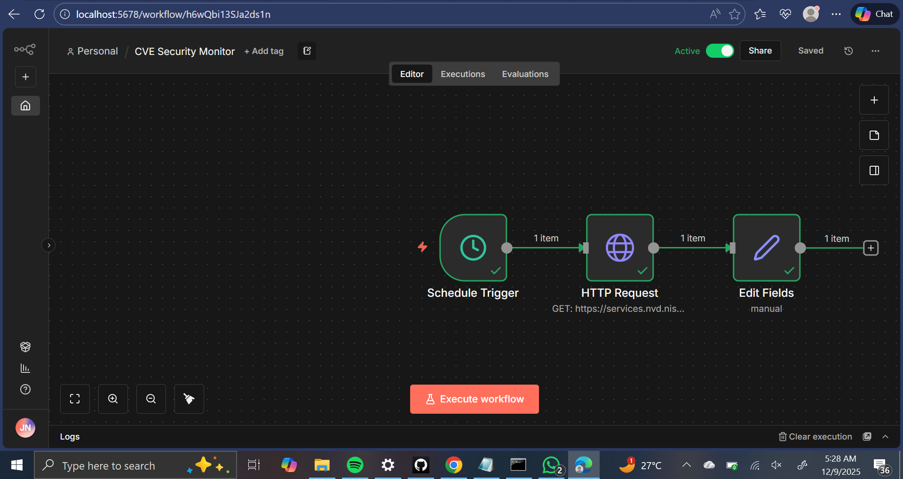

# 🔔 Automated CVE Security Monitor

An n8n automation workflow that continuously monitors the National Vulnerability Database (NVD) for new Common Vulnerabilities and Exposures (CVEs) and provides real-time security intelligence.

## Overview

This automated security monitoring system runs every 6 hours to fetch the latest vulnerability data from the official US government NVD API, demonstrating practical skills in security automation, API integration, and proactive threat intelligence gathering.

## Features

- **Automated Scheduling**: Runs every 6 hours without manual intervention
- **Real-Time CVE Data**: Fetches latest vulnerabilities from NVD REST API
- **Security Intelligence**: Monitors for critical vulnerabilities and security advisories
- **Scalable Architecture**: Built on n8n workflow automation platform
- **Zero-Code Integration**: Visual workflow builder for rapid development

## How It Works

### Workflow Architecture

1. **Schedule Trigger Node**
   - Executes workflow every 6 hours
   - Ensures continuous monitoring without manual intervention

2. **HTTP Request Node**
   - Connects to NVD API: `https://services.nvd.nist.gov/rest/json/cves/2.0`
   - Fetches latest 10 CVE entries
   - Retrieves vulnerability details, severity scores, and references

3. **Set Node**
   - Processes and structures CVE data
   - Extracts key information for analysis
   - Prepares data for alerts/storage

## Technical Details

**Platform**: n8n (open-source workflow automation)  
**API Source**: NIST National Vulnerability Database (NVD)  
**Trigger Frequency**: Every 6 hours (configurable)  
**Data Format**: JSON  
**Authentication**: None required (public API)

## Data Retrieved

Each CVE entry includes:
- CVE ID (e.g., CVE-2024-xxxxx)
- Vulnerability description
- CVSS severity scores
- Affected software/hardware
- Reference links to security advisories
- Published and modified dates

## Use Cases

**Security Operations Centers (SOC)**
- Continuous vulnerability monitoring
- Early threat detection
- Automated security intelligence gathering

**IT/DevOps Teams**
- Track vulnerabilities affecting infrastructure
- Proactive patch management
- Security compliance monitoring

**Security Researchers**
- Stay updated on latest vulnerabilities
- Research trending attack vectors
- Build security knowledge base

## What I Learned

### Technical Skills
- Workflow automation with n8n
- REST API integration and consumption
- Security data processing and structuring
- Scheduled task automation
- JSON data handling

### Security Concepts
- CVE (Common Vulnerabilities and Exposures) system
- National Vulnerability Database structure
- Vulnerability disclosure process
- Security intelligence gathering
- Proactive vs reactive security monitoring

### Automation Principles
- Event-driven architecture
- API-first design
- No-code/low-code platforms
- Modular workflow design
- Scalable automation patterns

## Installation & Setup

### Prerequisites
- Node.js installed
- n8n installed (`npm install -g n8n`)

### Running n8n
```bash
n8n start
```

### Importing the Workflow
1. Start n8n and navigate to `http://localhost:5678`
2. Click "Import from File"
3. Select `CVE_Security_Monitor.json`
4. Activate the workflow

### Customization Options
- Change trigger frequency (currently 6 hours)
- Adjust `resultsPerPage` parameter for more/fewer CVEs
- Add filters for specific severity levels
- Integrate email/Slack notifications
- Store data in database for historical analysis

## Future Enhancements

- [ ] Add email/Slack notifications for critical CVEs
- [ ] Filter by severity score (only alert on HIGH/CRITICAL)
- [ ] Database integration for historical tracking
- [ ] Geolocation analysis of affected systems
- [ ] Integration with asset management tools
- [ ] AI-powered vulnerability impact assessment
- [ ] Custom CVE search based on technology stack
- [ ] Automated JIRA ticket creation for vulnerabilities
- [ ] Webhook integration with SIEM platforms
- [ ] Dashboard visualization of trends

## Real-World Application

This workflow demonstrates essential skills for:
- **Security Automation Engineer** roles
- **SOC Analyst** positions requiring automation
- **DevSecOps** integration
- **Vulnerability Management** programs
- **Security Operations** modernization

## Security Best Practices Demonstrated

✅ Using official government security data sources  
✅ Automated continuous monitoring  
✅ API-first architecture  
✅ Scheduled, non-intrusive data collection  
✅ Structured data processing for scalability  

## Workflow Screenshot



## API Reference

**NVD CVE API v2.0**
- Base URL: `https://services.nvd.nist.gov/rest/json/cves/2.0`
- Documentation: https://nvd.nist.gov/developers/vulnerabilities
- Rate Limit: Public API (no authentication required)
- Response Format: JSON

## Sample Output
```json
{
  "resultsPerPage": 10,
  "totalResults": 267890,
  "vulnerabilities": [
    {
      "cve": {
        "id": "CVE-2024-12345",
        "descriptions": [...],
        "metrics": {...},
        "references": [...]
      }
    }
  ]
}
```

## Why This Matters

In modern cybersecurity:
- **73% of organizations** lack automated vulnerability monitoring
- **Average time to patch** critical vulnerabilities is 38 days
- **Automated monitoring** reduces detection time from days to hours
- **Proactive security** prevents incidents before they occur

This project demonstrates the ability to build practical automation that solves real security challenges.

---

**Technologies**: n8n, REST APIs, JSON, Node.js, Security Automation  
**Category**: Security Operations, Threat Intelligence, Automation  
**Difficulty**: Intermediate  
**Time to Build**: 2-3 hours